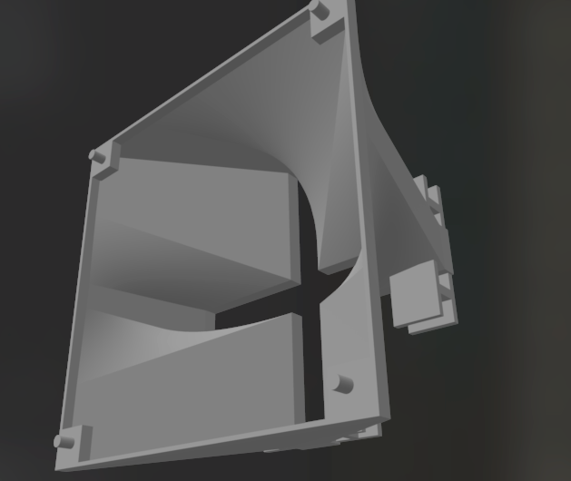

# extractor fan

i use this to mount a 120mm fan onto a 2x2 square of these cheap [LED lights](https://www.aliexpress.com/item/1005005703704621.html?spm=a2g0o.order_list.order_list_main.111.681c5c5f1o3CAH&gatewayAdapt=glo2deu).

Allows for cooling down the enclosure.

