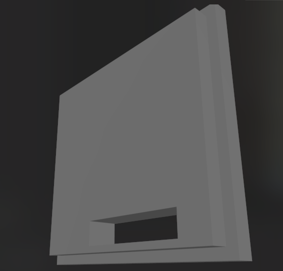
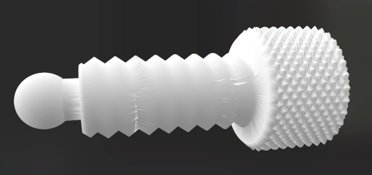
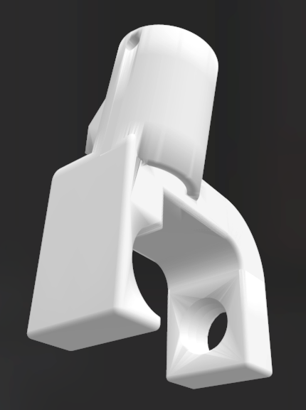
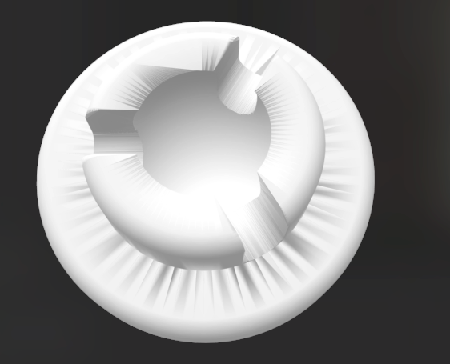

# vpdholder

designed to hold an SHT21 RH+temp sensor and a MLX90614 IR temp sensor. snap-fit.

## main case

holds the sensor, cap with holes for i2c sensor wires.

## vpdholder

can hold a EN16 pipe again, vpdholder can be fit onto it using zip ties.

